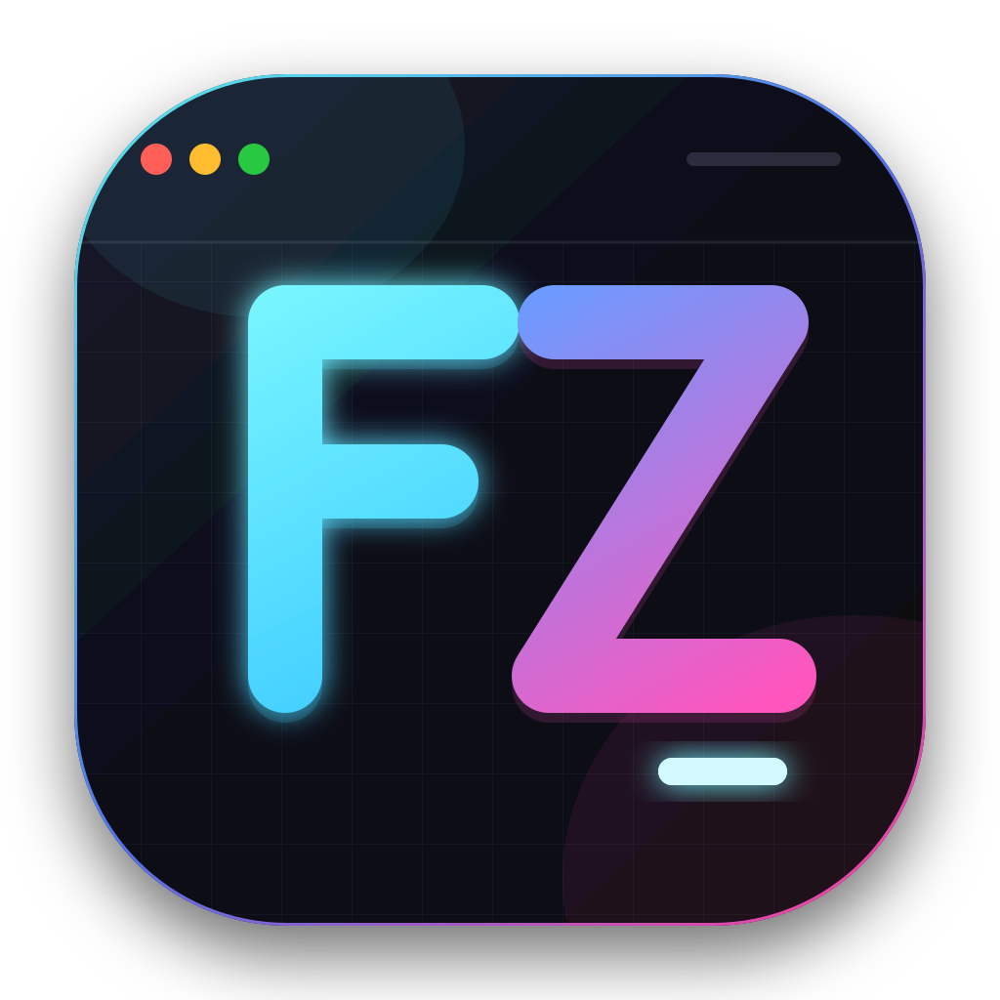

# FZ Terminal

<p align="center">
  
</p>

A minimal, high-functionality desktop terminal inspired by macOS. FZ Terminal
uses Electron, React, TypeScript, xterm.js, and real platform PTYs.

## Features

- real bash/zsh/fish/PowerShell sessions through `node-pty`
- workspaces, tabs, horizontal and vertical splits
- rename and close actions for tabs and workspaces
- draggable split dividers
- command library with folders
- terminal right-click menu with commands and pane actions
- modal settings divided into General, Appearance, Terminal, Shortcuts, and Commands
- configurable themes, ANSI palettes, fonts, cursor, scrollback, and shortcuts
- persistent layout and preferences
- shared development/installed profile with an atomic JSON backup
- in-app updates through GitHub Releases

## Run

The project ships with an isolated Node.js 24 LTS launcher:

```bash
./run.sh
```

Development mode with hot reload:

```bash
./dev.sh
```

Build an AppImage and Debian package:

```bash
./build.sh
```

Build the Windows x64 NSIS installer from Linux:

```bash
./build-windows.sh
```

Build unsigned macOS ZIP archives for Intel and Apple Silicon:

```bash
./build-macos.sh
```

Packaged artifacts are written to `release/`; renderer assets stay in `dist/`.

Install the Ubuntu/Debian package:

```bash
./release/Install-FZ-Terminal.sh
```

The installer finds the newest local DEB and requests Ubuntu administrator
authorization automatically. Direct installation also works, but the `./`
prefix is required so APT treats it as a local file:

```bash
sudo apt install ./release/FZ-Terminal-0.3.1-amd64.deb
```

Or run the portable AppImage:

```bash
chmod +x ./release/FZ-Terminal-0.3.1-x86_64.AppImage
./release/FZ-Terminal-0.3.1-x86_64.AppImage
```

Windows and macOS packages produced on Linux are unsigned. Public macOS
distribution still requires signing and notarization from a macOS runner.

Development and installed builds use the same per-user profile. On Linux it
is stored in `~/.config/fz-terminal`, with an additional atomic backup at
`~/.config/fz-terminal/profile.json`.

To publish a Linux update, increment the package version and run:

```bash
GH_TOKEN=github_token npm run release:linux
```

Publish the generated GitHub release rather than leaving it as a draft.
Installed builds check for updates after startup and also expose manual
status controls in Settings → Updates. New versions download automatically in
the background and install on the next normal application exit. AppImage
updates do not require administrator access; DEB updates can require the
standard Ubuntu authorization prompt when the package is replaced.

## Architecture

- `electron/main.cjs`: secure window lifecycle and PTY process manager
- `electron/preload.cjs`: narrow, validated IPC bridge
- `src/`: React renderer and application state
- `assets/fonts/`: bundled OFL fonts

Electron runs with Chromium sandboxing, `contextIsolation: true`, and
`nodeIntegration: false`. Terminal processes remain in the main process and
are only accessible through the validated preload bridge.
